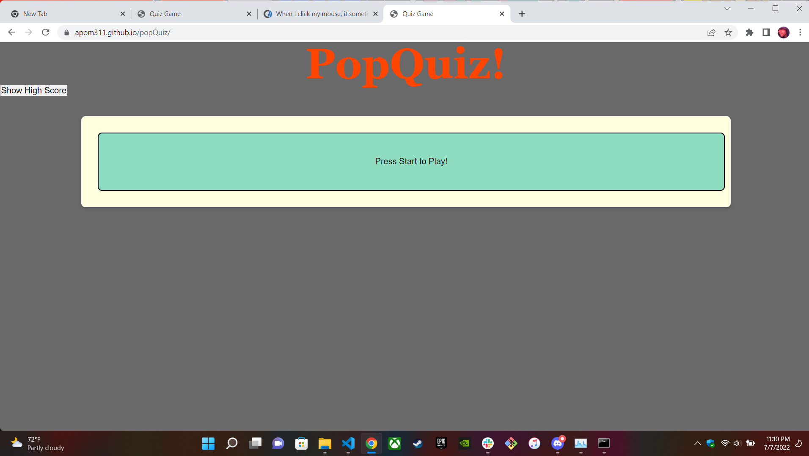

# popQuiz

code is currently incomplete

scores not able to be rendered at this time

questions made and set to read the correct answer based on user input
when correct answer is given extra time is rewarded
when wrong answer is given, penalty is time loss

score will be judged based solely through time remaining

questions&answers change in pairs using a for loop to listen for user answer and then progressing to next question regardless of correctness
if time runs out game ends with a score of 0

--using buttons for everything was a poor choice in planning--
really got caught up in always having to go back and fix them everytime I tried to add anything

[link to repo] (https://github.com/Apom311/popQuiz)
